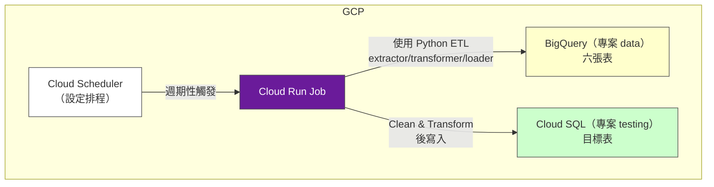
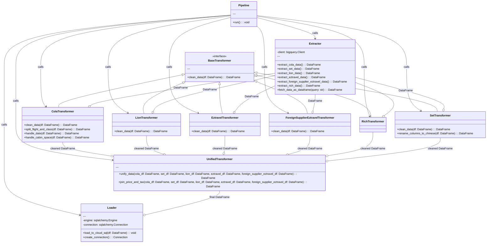

# Domanda 機票資料 ETL

## 專案背景 
本專案旨在建立一個高效且可擴展的 ETL 流程，用於從多個資料源中提取機票資料，進行清洗、轉換後，將結果由DataLuke寫入DataWarehouse，最終寫入前端使用者資料庫。
- 目的：
  - 提供可靠的資料基礎支持決策分析。
  - 簡化資料整合過程。
  - 減少資料手動干預。
- 重要性：
  - 幫助業務快速因應市場變化。
  - 支持 BI 分析工具運行。
- 特別注意事項：
  - 本專案用於暫時性的取代DataFlow，並非長期解決方案，待DataFlow完成後，將會廢棄本專案。

## 需求清單
- 功能需求
  - 數據提取：
      - 支援BigQuery來源。
  - 數據轉換：
      - 清洗異常數據（空值、重複值、錯誤格式）。
      - 支援自定義轉換規則（ETL 腳本）。
      - 數據映射功能，確保多系統之間字段對應。
  - 數據加載：
      - 支援跨專案的CloudSQL。
- 非功能需求
  - 效能要求：
      - 支持每日處理 10GB 以上數據，並保持處理時間小於 2 小時。
  - 擴展性：
      - 可快速新增數據來源類型。
  - 可靠性：
      - 99.9% 的系統可用性，支持故障恢復。

## 需求原因
- 業務需求：需整合可樂與競業的機票資料。
- 技術需求：現有爬蟲過程手動性強且較為費時，且無法滿足擴展需求。

## 使用場景
- 場景一：日常運營報告
      - 每日上午六點，系統自動爬蟲並提取可樂與競業資料，清洗並生成運營報表，供管理層於早會上使用。
- 場景二：異常排查
      - 資料科學家發現異常資料後，可通過 ETL 流程快速過濾和審核，調整清洗規則，並重新執行流程以獲取正確結果。

## 成功標準
- 準確性：提取、轉換和加載的數據與來源數據的差異率低於 5%。
- 效能：能夠在高峰時段依然保持穩定處理速率，並完成所有工作。
- 滿意度：90% 的使用者（如業務與資料科學家）對 ETL 流程的便利性和結果質量給予正面反饋。
- 錯誤處理：異常記錄的解決效率保持在 4 小時內，並提供清晰的錯誤報告。

## 1. 服務帳號與 IAM 權限

在部署整個解決方案前，需確保擁有合適的服務帳號 (Service Account) 及 IAM 權限，以便：
- **讀取 BigQuery** 「data」專案中的表格
- **寫入 Cloud SQL** 「testing」專案中的資料庫

### 1.1 建立或使用現有的 Service Account
- 如果您是新建一個專用的服務帳號，例如：`etl-runner@<PROJECT_ID>.iam.gserviceaccount.com`
- 為此服務帳號配置以下角色：
  - BigQuery Data Viewer 
  - Cloud SQL Client (供連線到 Cloud SQL 時使用)

### 1.2 Cloud SQL 連線設置
(本區塊需要雲端專家協助確認)
- 在使用 Serverless VPC Connector 或 Cloud SQL Auth proxy 連線 Cloud SQL 前，需要：
  - Cloud SQL 實例需在相同的 VPC Network 或同一個 GCP 專案內可以被存取。  
  - 記得在 Cloud SQL 連線白名單中加入 Cloud Run 執行時的 IP (若使用公網連線方式) 或是使用 **Serverless VPC Connector** 讓 Cloud Run Job 與 Cloud SQL 在同一個網路環境連線。

---

## 2. Python 專案結構與程式模組化

可以將整個 ETL 專案的程式碼放在一個 Git Repository 中，然後以 Docker 方式打包。  
專案結構範例（檔名與目錄僅供參考）：

```
my-etl-project/
├── Dockerfile
├── requirements.txt
├── main.py
├── config.py
├── etl
│   ├── extractor.py         # 從 BigQuery 提取資料
│   ├── loader.py            # 寫入 Cloud SQL
│   ├── transform
│   │   ├── base_transformer.py     # 可定義 Transformer 介面或基礎類別
│   │   ├── cola_transformer.py   # 清洗流程 A
│   │   ├── set_transformer.py   # 清洗流程 B
│   │   ├── lion_transformer.py   # 清洗流程 C
│   │   ├── eztravel_transformer.py # 清洗流程 D
│   │   ├── foreign_supplier_eztravel_transformer.py # 清洗流程 E
│   │   ├── rich_transformer.py # 清洗流程 F
│   │   └── unified_transformer.py  # 統一處理合併/整合邏輯
│   └── pipeline.py          # 串接 ETL 流程
└── tests
    ├── test_extractor.py
    ├── test_loader.py
    └── transform
        ├── cola_transformer.py   # 清洗流程 A
        ├── set_transformer.py   # 清洗流程 B
        ├── lion_transformer.py   # 清洗流程 C
        ├── eztravel_transformer.py # 清洗流程 D
        ├── foreign_supplier_eztravel_transformer.py # 清洗流程 E
        └── test_unified_transformer.py # 統一處理合併/整合邏輯
```

### 2.1 `extractor.py`
- 使用 `google-cloud-bigquery` Client Library 連接 BigQuery
- 提取六張表的資料，分別返回成 pandas 的 DataFrame。

### 2.2 `transformer.py`
- 專門負責清洗、轉換、合併等邏輯
- 依據業務需求，調整 DataFrame 欄位、格式或進行去重、欄位校驗等

### 2.3 `loader.py`
- 使用 Python SQL 客戶端 (如 `pymysql` / `sqlalchemy`) 寫入 Cloud SQL
- 建議使用批量寫入或以 DataFrame 的方式一次大量寫入

### 2.4 `main.py`
- 入口點 (entrypoint) 程式，整合 `extractor.py`, `transformer.py`, `loader.py` 進行 ETL
- 從環境變數（或 `config.py`）讀取連線參數、表名清單等

---

## 3. Docker 與 Cloud Run Job 部署

### 3.1 建立 Dockerfile
確保安裝對應的 Python 套件，如 `google-cloud-bigquery`, `pymysql`, `sqlalchemy` 等。

(dockerfile 暫定)

```dockerfile
# 選擇 python base image
FROM python:3.10-slim

# 複製 requirements.txt
COPY requirements.txt .

# 安裝 Python 相依套件
RUN pip install -r requirements.txt

# 複製程式碼
COPY . .

# 設定執行進入點
CMD ["python", "main.py"]
```

### 3.2 CI/CD 部署
(請雲端專家補充)
#### 3.2.1 使用 GCR 部署


---

## 4. 固定排程觸發

### 4.1 使用 Cloud Scheduler
- 設置一個 Scheduler job，每天/每小時/每週呼叫一次 Cloud Run Job

---

## 5. 整體建議與最佳實踐

1. **資料量大時**，可考慮在 BigQuery 端先做合併查詢 (使用 SQL) 後再轉成 DataFrame，減少在 Python 端記憶體消耗。
2. **增量加載**：如果您只想載入新資料，可以在 BigQuery 端做時間戳篩選或其他邏輯。
3. **Cloud SQL 效能**：  
   - 測試批量寫入 vs 單筆 upsert；使用正確索引或分區來優化查詢和寫入。
4. **授權與安全**：  
   - 資訊（DB 密碼、Host）建議使用 Secret Manager 或加密方式管理。
   - Cloud Run Job 與 Cloud SQL 建議使用私網連線搭配 Serverless VPC Connector，減少外網暴露風險。
5. **封裝與維護**：  
   - 將擴充程式碼拆分成更細的模組 (extract/transform/load) 有助於維護和測試。
   - 可以在 `tests/` 下撰寫單元測試，確保資料邏輯正確性。

---

## 6. 雲端架構圖示意



---

# 7. 類別圖示意


