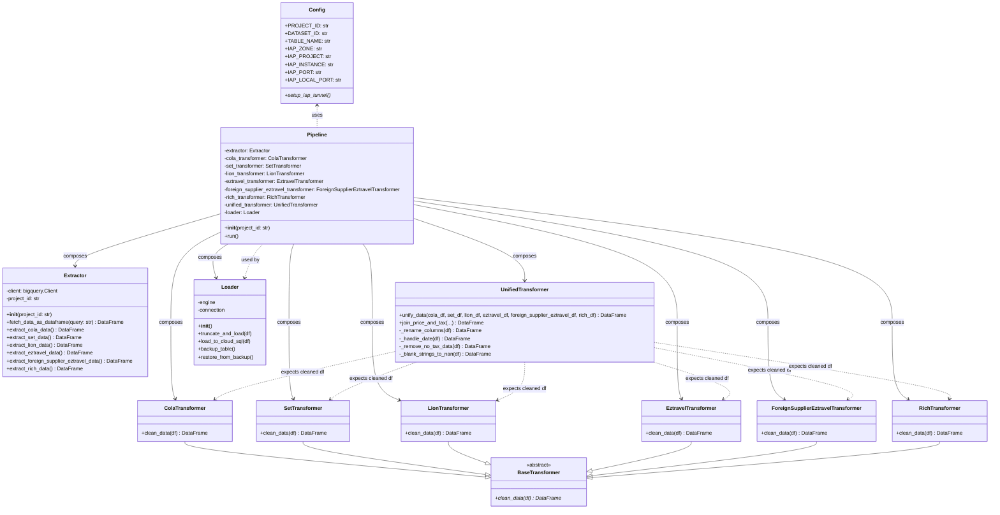

```mermaid
classDiagram
    class Config {
        +PROJECT_ID: str
        +DATASET_ID: str
        +TABLE_NAME: str
        +IAP_ZONE: str
        +IAP_PROJECT: str
        +IAP_INSTANCE: str
        +IAP_PORT: str
        +IAP_LOCAL_PORT: str
        +setup_iap_tunnel()*
    }

    class Pipeline {
        -extractor: Extractor
        -cola_transformer: ColaTransformer
        -set_transformer: SetTransformer
        -lion_transformer: LionTransformer
        -eztravel_transformer: EztravelTransformer
        -foreign_supplier_eztravel_transformer: ForeignSupplierEztravelTransformer
        -rich_transformer: RichTransformer
        -unified_transformer: UnifiedTransformer
        -loader: Loader
        +__init__(project_id: str)
        +run()
    }

    class Extractor {
        -client: bigquery.Client
        -project_id: str
        +__init__(project_id: str)
        +fetch_data_as_dataframe(query: str) DataFrame
        +extract_cola_data() DataFrame
        +extract_set_data() DataFrame
        +extract_lion_data() DataFrame
        +extract_eztravel_data() DataFrame
        +extract_foreign_supplier_eztravel_data() DataFrame
        +extract_rich_data() DataFrame
    }

    class BaseTransformer {
        <<abstract>>
        +clean_data(df) DataFrame*
    }

    class ColaTransformer {
        +clean_data(df) DataFrame
    }

    class SetTransformer {
        +clean_data(df) DataFrame
    }

    class LionTransformer {
        +clean_data(df) DataFrame
    }

    class EztravelTransformer {
        +clean_data(df) DataFrame
    }

    class ForeignSupplierEztravelTransformer {
        +clean_data(df) DataFrame
    }

    class RichTransformer {
        +clean_data(df) DataFrame
    }

    class UnifiedTransformer {
        +unify_data(cola_df, set_df, lion_df, eztravel_df, foreign_supplier_eztravel_df, rich_df) DataFrame
        +join_price_and_tax(... ) DataFrame
        -_rename_columns(df) DataFrame
        -_handle_date(df) DataFrame
        -_remove_no_tax_data(df) DataFrame
        -_blank_strings_to_nan(df) DataFrame
    }

    class Loader {
        -engine
        -connection
        +__init__()
        +truncate_and_load(df)
        +load_to_cloud_sql(df)
        +backup_table()
        +restore_from_backup()
    }

    Config <.. Pipeline : uses
    Pipeline --> Extractor : composes
    Pipeline --> ColaTransformer : composes
    Pipeline --> SetTransformer : composes
    Pipeline --> LionTransformer : composes
    Pipeline --> EztravelTransformer : composes
    Pipeline --> ForeignSupplierEztravelTransformer : composes
    Pipeline --> RichTransformer : composes
    Pipeline --> UnifiedTransformer : composes
    Pipeline --> Loader : composes

    ColaTransformer --|> BaseTransformer
    SetTransformer --|> BaseTransformer
    LionTransformer --|> BaseTransformer
    EztravelTransformer --|> BaseTransformer
    ForeignSupplierEztravelTransformer --|> BaseTransformer
    RichTransformer --|> BaseTransformer

    UnifiedTransformer ..> ColaTransformer : expects cleaned df
    UnifiedTransformer ..> SetTransformer : expects cleaned df
    UnifiedTransformer ..> LionTransformer : expects cleaned df
    UnifiedTransformer ..> EztravelTransformer : expects cleaned df
    UnifiedTransformer ..> ForeignSupplierEztravelTransformer : expects cleaned df
    UnifiedTransformer ..> RichTransformer : expects cleaned df

    Loader <.. Pipeline : used by
```

