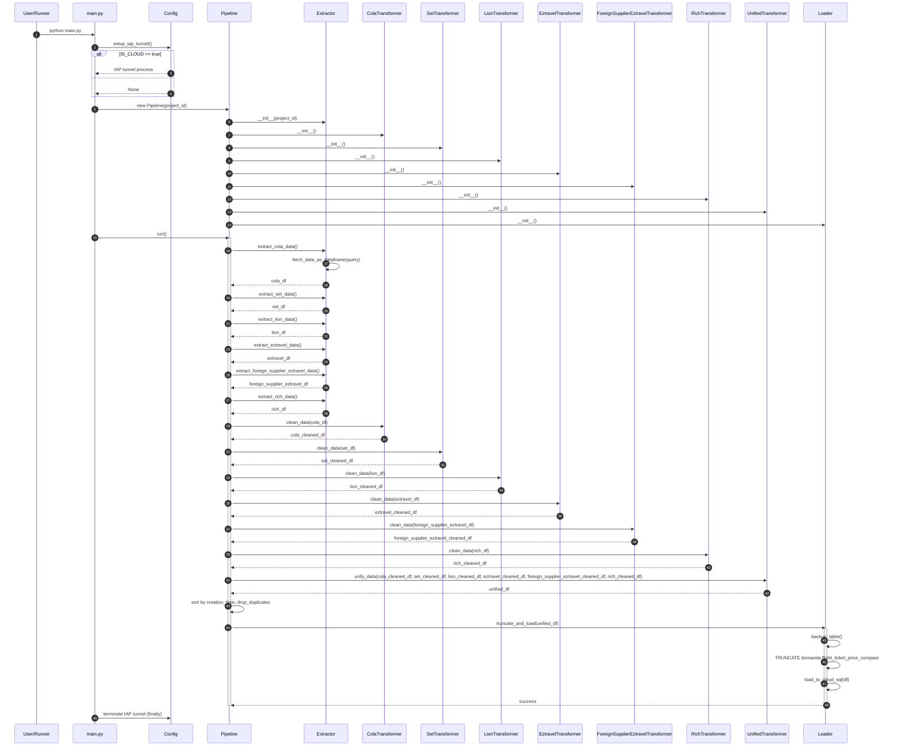

```mermaid
sequenceDiagram
    autonumber
    participant User as User/Runner
    participant Main as main.py
    participant Config as Config
    participant Pipeline as Pipeline
    participant Extractor as Extractor
    participant Cola as ColaTransformer
    participant Set as SetTransformer
    participant Lion as LionTransformer
    participant Ez as EztravelTransformer
    participant FEz as ForeignSupplierEztravelTransformer
    participant Rich as RichTransformer
    participant Unified as UnifiedTransformer
    participant Loader as Loader

    User->>Main: python main.py
    Main->>Config: setup_iap_tunnel()
    alt IS_CLOUD == true
        Config-->>Main: IAP tunnel process
    else
        Config-->>Main: None
    end

    Main->>Pipeline: new Pipeline(project_id)
    Pipeline->>Extractor: __init__(project_id)
    Pipeline->>Cola: __init__()
    Pipeline->>Set: __init__()
    Pipeline->>Lion: __init__()
    Pipeline->>Ez: __init__()
    Pipeline->>FEz: __init__()
    Pipeline->>Rich: __init__()
    Pipeline->>Unified: __init__()
    Pipeline->>Loader: __init__()

    Main->>Pipeline: run()
    activate Pipeline
    Pipeline->>Extractor: extract_cola_data()
    Extractor->>Extractor: fetch_data_as_dataframe(query)
    Extractor-->>Pipeline: cola_df
    Pipeline->>Extractor: extract_set_data()
    Extractor-->>Pipeline: set_df
    Pipeline->>Extractor: extract_lion_data()
    Extractor-->>Pipeline: lion_df
    Pipeline->>Extractor: extract_eztravel_data()
    Extractor-->>Pipeline: eztravel_df
    Pipeline->>Extractor: extract_foreign_supplier_eztravel_data()
    Extractor-->>Pipeline: foreign_supplier_eztravel_df
    Pipeline->>Extractor: extract_rich_data()
    Extractor-->>Pipeline: rich_df

    Pipeline->>Cola: clean_data(cola_df)
    Cola-->>Pipeline: cola_cleaned_df
    Pipeline->>Set: clean_data(set_df)
    Set-->>Pipeline: set_cleaned_df
    Pipeline->>Lion: clean_data(lion_df)
    Lion-->>Pipeline: lion_cleaned_df
    Pipeline->>Ez: clean_data(eztravel_df)
    Ez-->>Pipeline: eztravel_cleaned_df
    Pipeline->>FEz: clean_data(foreign_supplier_eztravel_df)
    FEz-->>Pipeline: foreign_supplier_eztravel_cleaned_df
    Pipeline->>Rich: clean_data(rich_df)
    Rich-->>Pipeline: rich_cleaned_df

    Pipeline->>Unified: unify_data(cola_cleaned_df, set_cleaned_df, lion_cleaned_df, eztravel_cleaned_df, foreign_supplier_eztravel_cleaned_df, rich_cleaned_df)
    Unified-->>Pipeline: unified_df
    Pipeline->>Pipeline: sort by creation_time, drop_duplicates
    Pipeline->>Loader: truncate_and_load(unified_df)
    activate Loader
    Loader->>Loader: backup_table()
    Loader->>Loader: TRUNCATE domanda.flight_ticket_price_compare
    Loader->>Loader: load_to_cloud_sql(df)
    Loader-->>Pipeline: success
    deactivate Loader
    deactivate Pipeline

    Main->>Config: terminate IAP tunnel (finally)
```

